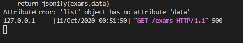

# Backend-Flask-Docker

Construção de uma aplicação com três partes. O [backend](https://github.com/TiagoGIM/Backend-Flask-Docker) em Python, o front-end será feito com o Angular cli(node.js) e os [dados persistentes](##-Banco-de-dados) ficarão em um servidor que rodará em um container (docker).
O objetivo é transformar todas as partes em containers.

## Jornada de aprendizado
Como eu sempre reclamo que os tutoriais pulam as partes que tem bug, decidi relatar neste arquivo [detalhes e bugs](https://github.com/TiagoGIM/Backend-Flask-Docker/blob/dev/detalhes_e_bugs.txt) cada erro e como eu contornei(ou tentei).
Coloquei em [leituras interessantes](#-Leituras-interessantes.) alguns links que consultei durante a realização do tutorial, a final o objetivo é entender como as coisas funcionam.

### Parte 1
O primeiro bug foi na main.py, uma propriedade de objeto que não existia ```data``` penas retirei o ".data" e não tive mais este problema.
<div align="center">
       
</div>

## Ambiente de desenvolvimento
libs usadas estão em [requirements.txt](https://github.com/TiagoGIM/Backend-Flask-Docker/blob/dev/requirements.txt)

O desenvolvimento foi feito no windows com subsistema linux (WSL).
```
├── Backend
|   ├──scr
|       ├──entities
|           ├──entity.py
|           ├──exam.py
|   ├──main.py
```

## Banco de dados
```
$ docker run --name online-exam-db -p 5432:5432 -e POSTGRES_DB=online-exam -e POSTGRES_PASSWORD=0NLIN3-ex4m -d postgres
```

## Links úteis

- [Tutorial Parte - 1](https://auth0.com/blog/using-python-flask-and-angular-to-build-modern-apps-part-1).
- [WSL  instalação](https://docs.microsoft.com/pt-br/windows/wsl/install-win10).

## Requisitos
- Docker
- Python 3.8

# Leituras interessantes.
- [Jango ou Flask ?](https://www.treinaweb.com.br/blog/django-ou-flask-eis-a-questao)
- Um pouco sobre Cross-Origin Resource Sharing [(CORS)](https://developer.mozilla.org/en-US/docs/Web/HTTP/CORS)
- Mão na massa com docker [Youtube - Codigo Aberto](https://www.youtube.com/watch?v=97jWpWp4Pnc&ab_channel=C%C3%B3digoFonteTV)
